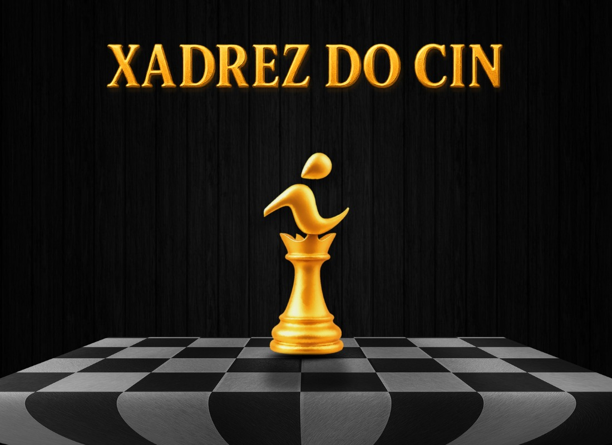
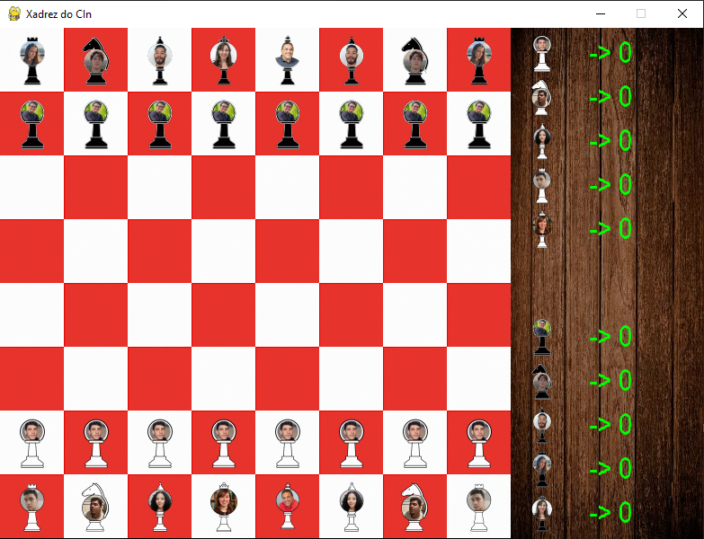

# Projeto-IP-2024.2

Repositório referente à entrega do projeto da disciplina **Introdução à Programação** da Equipe 4.

## Descrição

Este projeto tem como objetivo desenvolver um simples jogo de xadrez utilizando a linguagem Python. O jogo implementa as regras oficiais do xadrez e possui uma interface gráfica para interação com o usuário.

## Funcionalidades

- Implementação completa das regras do xadrez.
- Interface gráfica para facilitar a interação do usuário.
- Suporte a partidas entre dois jogadores locais.

## Descrição da Arquitetura do Projeto

O projeto foi estruturado de forma modular, facilitando a manutenção, a escalabilidade e a identificação da responsabilidade de cada parte do sistema. Confira a seguir o papel de cada arquivo e diretório:

- **main.py**  
  Arquivo principal que inicia a execução do jogo, gerenciando a inicialização das configurações e chamando a interface gráfica.

- **configuracoes.py**  
  Define parâmetros globais, configurações do jogo e constantes utilizadas por todo o sistema.

- **funcoes_do_jogo.py**  
  Concentra as funções auxiliares para a lógica do jogo, como validações de jogadas, controle de turnos e condições de xeque/xeque-mate.

- **base_peca.py**  
  Contém a classe base para todas as peças do xadrez, definindo atributos e métodos comuns.

- **peao.py, torre.py, cavalo.py, bispo.py, rainha.py, rei.py**  
  Implementam as características e regras específicas de cada peça, herdando e estendendo a funcionalidade definida em `base_peca.py`.

- **imagens/**  
  Diretório destinado ao armazenamento dos recursos gráficos utilizados na interface (imagens das peças e do tabuleiro).

## Galeria de Projetos

  
*Legenda: Capa inicial do jogo com os professores homenageados!*


  
*Legenda: Jogo iniciado*

## Ferramentas, Bibliotecas e Frameworks Utilizados

- **Python 3.13.x**  
  > Escolhido pela sua robustez e legibilidade, facilitando o desenvolvimento do projeto.

- **Pygame**  
  > Biblioteca utilizada para a criação da interface gráfica e gerenciamento dos eventos do jogo, permitindo uma implementação interativa e dinâmica.

- **Os**
  > Este módulo fornece uma maneira simples de usar funcionalidades que são dependentes do sistema operacional. Em nosso código foi usado para manipular pastas e aquivos, checando o tamanho dessas pastas.

## Como Executar

1. Clone este repositório:
   ```bash
   git clone https://github.com/Monkius-Maximus/Projeto-IP-2024.2.git


# Abrir o projeto
Abra a pasta clonada em seu editor de código favorito.

# Iniciar o jogo
Execute o arquivo main.py

# O seu editor de código rodará o jogo em uma nova janela.   

## 1) Membros da `Equipe 4` 👥:
<br>


- [Agata Giovanna (agma)](https://github.com/brunoMaximo5)
- [Diogo Rodrigues (dsr)](https://github.com/Monkius-Maximus)
- [Flavia Vitória (fves)](https://github.com/Flavitche) 
- [Gryghor Camonni (gcfc)](https://github.com/Gryghor)
- [Guilherme Barbosa (gbs5)](https://github.com/Guilherme-Barbosa06)
- [Lucas Amaral (lba4)](https://github.com/lucas-amaral-06)


## 2) Link para repositório git
  
   https://github.com/Monkius-Maximus/Projeto-IP-2024.2


##  3) Conceitos Utilizados

Durante o desenvolvimento deste projeto, os conceitos apresentados durante a disciplina foram aplicados em diversas áreas, tais como:

  Programação Orientada a Objetos:
  Utilizada na criação das classes para as peças do xadrez, promovendo reutilização e modularização do código.

  Modularização:
  A separação do código em diversos módulos (por exemplo, lógica do jogo, configuração e interface gráfica) facilitou a manutenção e futuras extensões.

  Estruturas de Dados e Controle de Fluxo:
  Uso de listas, dicionários, loops e condicionais para gerenciar os movimentos das peças e o estado do jogo.

## 4) Divisão de Trabalho

  Graças a proporcional quantidade de membros e o número de peças que compõem o jogo de xadrez foram sorteadas as peças onde cada integrante fez a lógica de funcionamento de sua respectiva peça, ajustando os arquivos base para cumprir com as mecãnicas e assumiu alguma outra função para auxiliar o desenvolvimento da equipe:

> Agata Giovanna (agma) - Classe Cavalo, design de ícones e assets, Comunicações

> Diogo Rodrigues (dsr) - Classe Peão Relatório e planejamento da apresentação, Sons e música

> Flavia Vitória (fves) - Classe Bispo, Menu do jogo, UI, Música e Sons

> Gryghor Camonni (gcfc) - Classe Rainha, UI, Música e Sons

> Guilherme Barbosa (gbs5) - Classe Rei, Design de Assets, UI

> Lucas Amaral (lba4) - Classe Torre, Project Lead, Código principal do jogo, Menu inicial


##  5) Desafios, Erros e Lições Aprendidas
  Como todo projeto, ocorrem as mais adversas situações que acabam tranzendo imprevistos que levam a atrasos, bugs e claro bastante dor de cabeça, por isso elencando as mais comuns dentre os integrantes da equipe poderiamos citar: 

Scope creep;

  > Inicialmente pretendiamos realizar projetos bem mais "inovadores" porém ao aprofundar no desenvolvimento tivemos um choque de realidade, e precissamos abandonar muitas ideias graças a natureza do projeto.

Conciliação com as obrigações de outras disciplinas;

  > De maneira geral os integrantes  da equipe ainda estão tendo o primeiro contato com a vida universitária e não esperavamos tamanho salto de dificuldade e necessidade de dedicação as cadeiras do curso (especialmente na segunda unidade do período) onde os assuntos se tornaram consideravelmente dificeis se comparados com os que viamos no ensino médio.

Falta de familiaridade com as ferramentas do GitHub;

  > Foi o primeiro contato com o Github para mais da metade dos integrantes então nossos primeiros de projeto foram basicamente dedicados a discutirmos o que iriamos fazer e a aprender a utilizar o Git e o Github.

Implementação das proporções de imagens e tela;

  > Um grande problema que percebemos com o pygame é a sua limitação no quesito telas onde as nossas opções para contornar essas dificuldades foram optar por uma resolução fixa e calcular como poderiamos fazer para deixar nossos assets em uma proporção menor do que as suas originais.

Familiarização com conceitos de POO;

  > Progamação Orientada a Objeto pode ser considerado mais um grande montanha que precisou ser escalada pela equipe já que é uma realidade diferente do que estavamos acostumados, não foi trivial aprender tais conceitos no entanto após o amadurecimento dessas ideias percebemos a sua importancia para o nosso currículo e aprendizagem de progamação de maneira geral.

Dificuldades na implementação de regras específicas do xadrez;

  > apesar de parecer um projeto "Simples" o jogo de Xadrez demonstrou o motivo de se manter basicamente inalterado por tantos séculos, já que inicialmente a pessoa pode entender as movimentações de peças e quem sabe ameaçar jogadas, porém as quase infinitas jogadas que pode ocorrer a qualquer momento foi um ponto de desenvolvimento que não esperavamos ser tão complexo de se implementar e testar sem que ocorressem bugs.

## Integrantes

<table align="center">
  <tr>
    <td align="center">
      <a href="https://github.com/agatagio">
        <br>
        <sub><b>Agata Giovanna</b></sub>
      </a>
    </td>
    <td align="center">
      <a href="https://github.com/Monkius-Maximus">
        <br>
        <sub><b>Diogo Rodrigues</b></sub>
      </a>
    <td align="center">
      <a href="https://github.com/Flavitche">
        <br>
        <sub><b>Flavia Vitória</b></sub>
      </a>
    </td>
    <td align="center">
      <a href="https://github.com/Gryghor">
        <br>
        <sub><b>Gryghor Camonni</b></sub>
      </a>
          <td align="center">
      <a href="https://github.com/Guilherme-Barbosa06">
        <br>
        <sub><b>Guilherme Barbosa</b></sub>
      </a>
    </td>
    </td>
        <td align="center">
      <a href="https://github.com/lucas-amaral-06">
        <br>
        <sub><b>Lucas Amaral</b></sub>
        </a>
    </td>
  </tr>
</table>